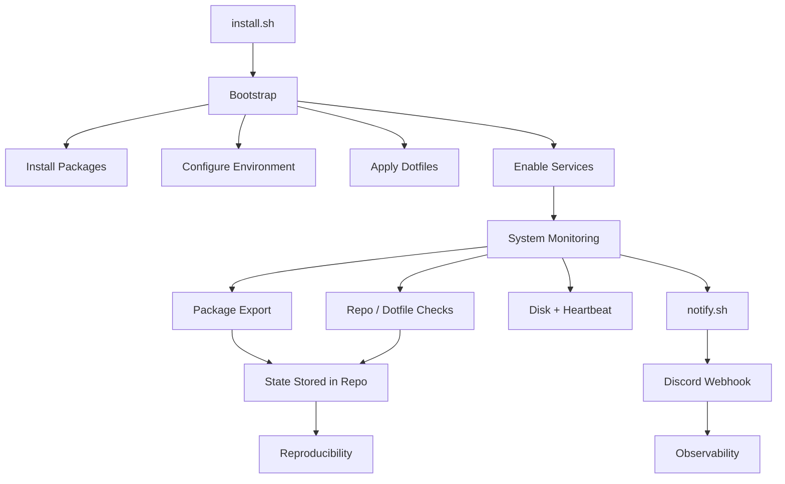

# 🧠 linux-environments

> Reproducible, observable, and automated Linux systems.

---

## 💡 Philosophy

> **A system should be recoverable, inspectable, and self-reporting.**

This repo is not just dotfiles — it’s a **unified platform** for managing multiple machines with:

* 🔁 **Reproducibility** — rebuild any system from scratch
* 🧱 **Recoverability** — always know and restore system state
* ⚙️ **Automation** — systems maintain themselves
* 🔔 **Observability** — systems report what they’re doing

---

## ⚡ Mental Model

```text
Define → Apply → Observe → Correct → Repeat
```

* **Define** → package lists + configs
* **Apply** → bootstrap + stow
* **Observe** → services + notifications
* **Correct** → update repo
* **Repeat** → consistent across all machines

---

## 🖥️ Systems

| Machine           | ID          | OS     |
| ----------------- | ----------- | ------ |
| 💼 Dell Precision | `laptop01`  | Arch   |
| 💻 HP Envy        | `laptop02`  | Ubuntu |
| 🧪 Covid PC       | `desktop01` | Arch   |
| 🐳 Docker Server  | `server01`  | Ubuntu |

Each machine is **independently defined, consistently managed**.

---

## 🧩 Structure

```text
linux-environments/
├── install.sh      # entry point
├── scripts/        # automation (notify, export, stow)
├── system/         # package/state per machine
├── hosts/          # machine-specific configs
├── stow/           # shared dotfiles
├── systemd/        # services + timers
└── wallpaper/
```

---

## 🔄 How It Works

### Quick flow

```text
install.sh
   ↓
bootstrap (machine + OS)
   ↓
packages → environment → dotfiles → services
   ↓
state exported + monitored
   ↓
notifications sent (Discord)
```

---

### Visual flow



---

## 🚀 Install

```bash
git clone https://github.com/matthewjgarry/linux-environments.git ~/dotfiles
cd ~/dotfiles
./install.sh
```

Installer will:

* 🖥️ select machine
* 🧠 detect OS
* 🔑 configure git
* 🔔 configure Discord webhook
* 🆔 set machine identity
* 🚀 launch bootstrap

---

## 🧪 Bootstrap

Each bootstrap:

* verifies machine + OS
* installs packages (apt / pacman / flatpak / snap / brew)
* configures environment (GNOME, shell, defaults)
* applies dotfiles (`stow`)
* installs services
* exports system state
* displays summary → reboot

---

## 📦 Package State

```text
system/<machine>/<os>/
├── apt.txt | pacman.txt
├── flatpak.txt
├── snap.txt
└── brew.txt
```

* **source of truth**
* automatically synced from system → repo

---

## 🔗 Configuration

* shared → `stow/`
* per-machine → `hosts/<machine>/<os>/`

Applied automatically during bootstrap.

---

## ⚙️ Automation

User-level services handle:

* 📦 package tracking
* 🔄 system updates
* 🔍 repo drift detection
* 🧾 dotfile changes
* 💾 disk monitoring
* ❤️ heartbeat

Systems are **continuously self-aware**.

---

## 🔔 Notifications

All machines report to Discord.

```bash
notify.sh "Disk Warning" "Root is 91% full" warning
```

| Level | Meaning |
| ----- | ------- |
| ℹ️    | info    |
| ✅     | success |
| ⚠️    | warning |
| ❌     | error   |

Each message includes:

* machine ID
* hostname
* timestamp

---

## 🧠 Identity

```bash
~/.config/dotfiles/machine-id
```

Ensures:

* correct config targeting
* safe automation
* separation of machine state

---

## 📌 Summary

* 🔁 reproducible systems
* 🧱 recoverable state
* ⚙️ automated maintenance
* 🔔 centralized visibility

---

## 🧑‍💻 Author

Matthew J Garry
